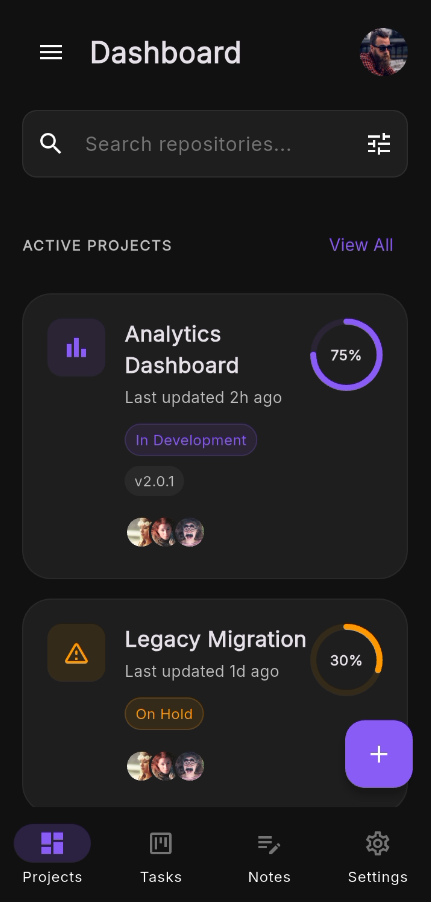
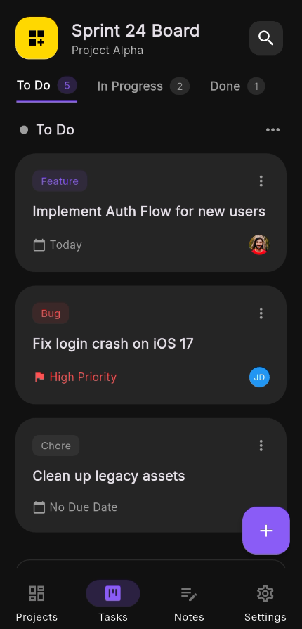
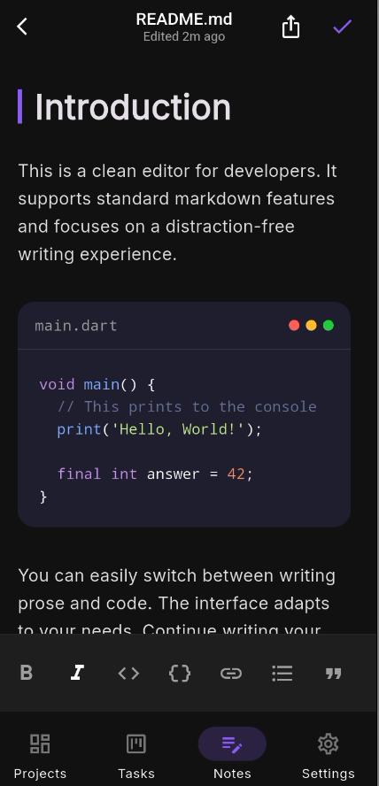

# DevFocus

DevFocus is a high-fidelity productivity application designed specifically for engineering teams. Built with Flutter, it features a modern, dark-mode aesthetic tailored to reduce eye strain and maximize focus.

## Features

*   **Authentication**: Secure login and sign-up flow with a sleek UI.
*   **Projects Dashboard**: Visualize active projects, progress, and status at a glance.
*   **Kanban Board**: Drag-and-drop task management with "To Do", "In Progress", and "Done" columns.
*   **Markdown Note Editor**: Distraction-free writing experience with code syntax highlighting simulation.
*   **Settings**: Comprehensive user preferences including theme and notification management.

## Tech Stack

*   **Framework**: Flutter
*   **State Management**: Riverpod
*   **Navigation**: GoRouter
*   **Fonts**: Google Fonts (Inter)
*   **Icons**: Material Symbols & Custom Assets

## Getting Started

1.  **Prerequisites**: Ensure you have Flutter installed (`flutter doctor`).
2.  **Dependencies**: Run `flutter pub get` to install required packages.
3.  **Run**: Execute `flutter run` to launch the application on your preferred emulator or device.

## Screenshots

Project dashboard:

Kanban board:

Notes editor:
